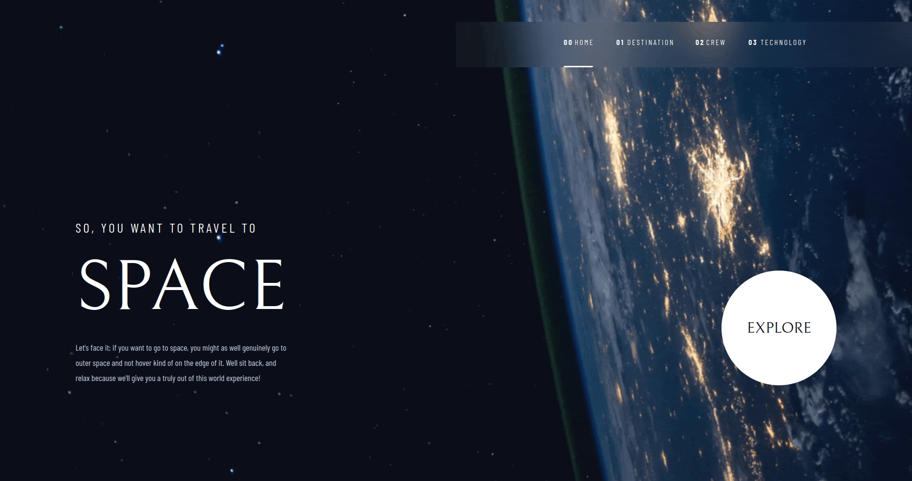

## Space Tourism (Frontend)

Space tourism is a web application built for a challenge on Frontendmentor.io using React, Javascript, and CSS.

Visit Space Tourism [Here](https://neptunerjo.github.io/space-tourism/)

## Installation and setup

- Clone or download this reprository. You will need `node` and `npm` installed globally on your machine.
- Run `npm install` to install the dependencies.
- Run `npm start` to start an instance on `localhost:3000`

## Reflection

This was a project built as a challenge listend on [Frontend Mentor](https://www.frontendmentor.io/challenges/space-tourism-multipage-website-gRWj1URZ3).
Project goals included familiarizing technologies learned up untill this point such as React and its various tools.

Originally this project was built at the beginning of my React journey, but recently I took on the challenge of refactoring my 7+ month old code
to improve the React functionality and the CSS.

The main challenge of this project was creating a fluid mobile-first responsive design. Creating a design system helped drastically with minimizing the amount of
repeating CSS and drastically took the load off of creating responsiveness; and allowed for the quick application of classes to components.
I was able to create a (somewhat) decent transition between breakpoint by using `min()` and percentages instead of pixels for measurements.

At the end of the day, the technologies used in this project are `React`, `React-Router`, and a large amount of CSS. I chose to use `create-react-app`
boilerplate to minimize initial setup time.
