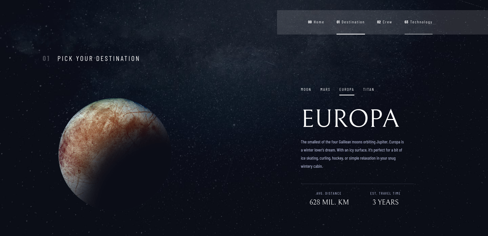
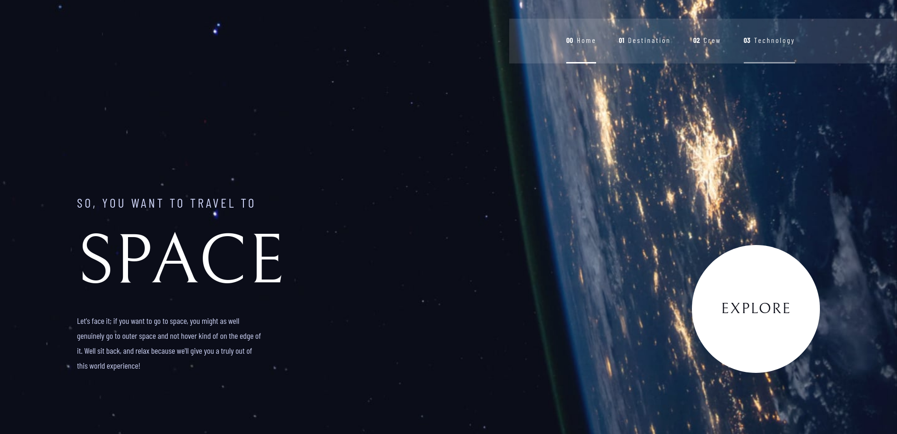

## Project Title

Space Tourism Website

## Demo Link:

Access my site at [Demo Link](https://neptunerjo.github.io/space-tourism/)

## Table of Content: 

- [About The App](#about-the-app)
- [Screenshots](#screenshots)
- [Technologies](#technologies)
- [Setup](#setup)
- [Approach](#approach)

## About the App

The Space Tourism Website is a responsive informational website built with React. 

This project is mainly for experimenting with different techniques and developing my React skills...
I gained a lot of experience with React, particularly with the in-page content navigation. 
Functional Components and `useState` make dynamic content very easy.

This is a solution to the [Space tourism website challenge on Frontend Mentor](https://www.frontendmentor.io/challenges/space-tourism-multipage-website-gRWj1URZ3). Frontend Mentor challenges help you improve your coding skills by building realistic projects. 

## Screenshots

## Technologies

Built using `html`, `css`, `React`, `Figma`, and `Prettier`.

## Setup

- Download or clone the repository
- Run `npm install`
- Run `npm start` to view a local version on `http://localhost:3000/`

## Approach

- The home page roughly uses `BEM` naming conventions for class names, but everything else uses standard css conventions.
- I used `useState` to render dynamic content on multiple pages, creating both an index for JSON data and a convention for applying classes. 
- `useEffect` also came in handy for applying styles to the navbar on each page's render.

